# Учебное пособие - cracme1_by_br0ken

## Analyst: Velana

## Host OS: Linux

## Tools Used:  IDA Pro (статический анализ), VirtualBox(Windows)

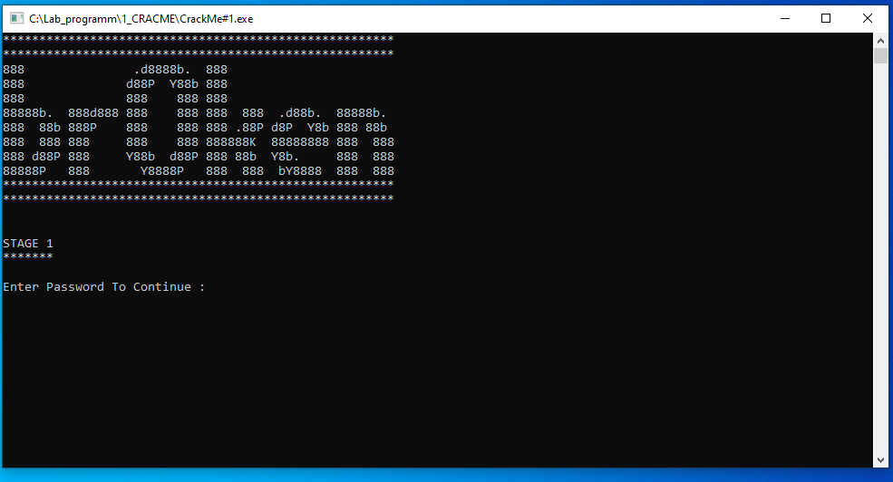

*Рис.1. Старт crackme

## Инструкции автора

1. Этап 1 — Найти пароль (без патчинга).
2. Этап 2 — Кейген (без патчинга).
3. Этап 3 — Пропатчить.
4. В процессе исследования могут быть найдены баги.

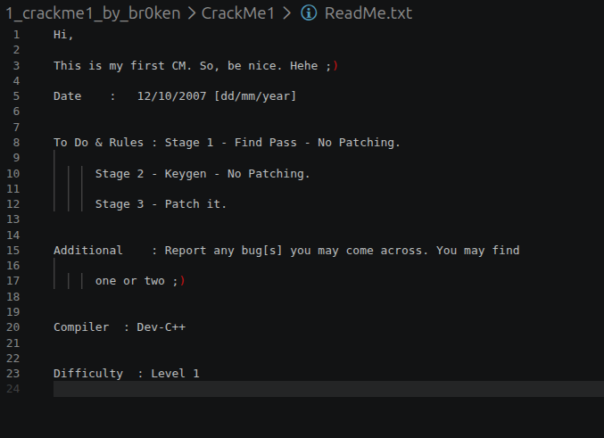

*Рис.2. Инструкции автора

## Процесс исследования

### Этап 1 - найти пароль

1. Исполняемый файл был загружен в Linux-версию IDA Pro. На этапе первичного статического анализа я перешла во вкладку доступных строк (Strings).

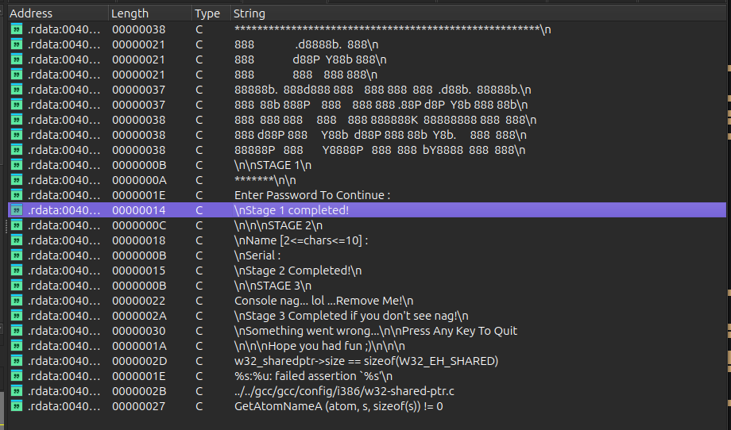

*Рис.3. Доступные строки*

Обнаружив строку успешного прохождения "Stage 1 completed!", применила метод анализа "от обратного". Используя перекрестные ссылки (XREFs) адреса .rdata:004031FF (где хранится данный текст), я перешла в вызывающую функцию.

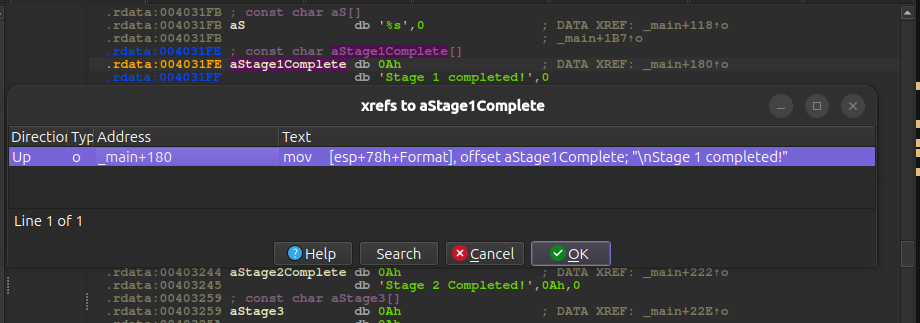

*Рис.4. Перекрестные ссылки для строки*

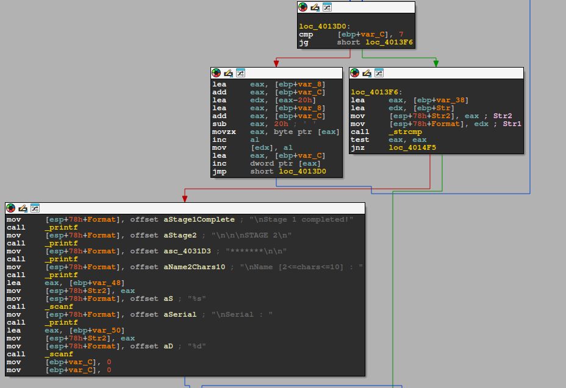

*Рис.5. Переход по ссылке*

2. **Анализ логики (Декомпиляция)**: Переключившись в окно встроенного декомпилятора (Pseudocode),

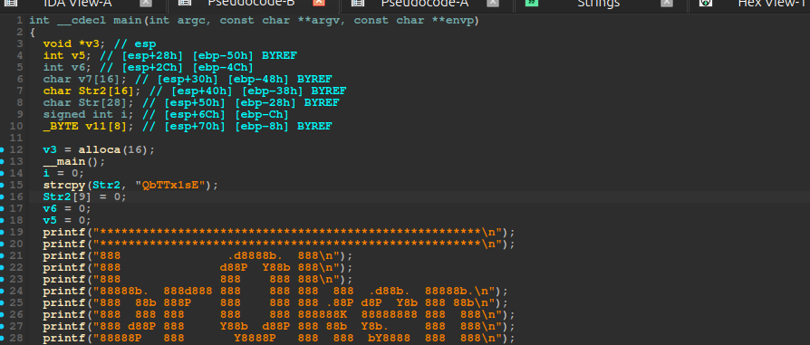
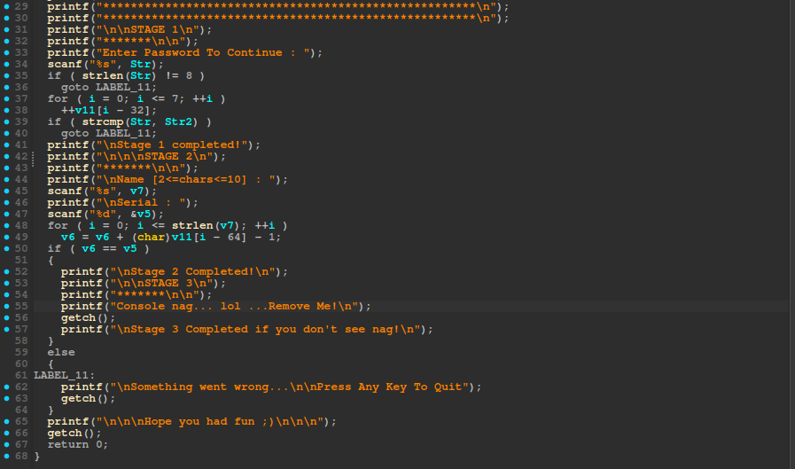

*Рис.6-7. Функция в декомпиляторе*

я увидела, что в начале функции выделяется память на стеке локальным переменным и в частности меня заинтересовала переменная Str2(массив), которой выделено 16 байт и которая позже инициализируется строкой "QbTTx1sE" размером 8 байт(плюс 1 байт на null-терминатор):

    ```C
    // начальные действия с переменной Str2
    char Str2[16];   // [esp+40h] [ebp-38h] BYREF

    // часть кода опущена

    strcpy(Str2, "QbTTx1sE");         // записывает в массив 8 байт текста и '\0'
    Str2[9] = 0;                      // артефакт компилятора, зануляющий 10-й байт массива
    // часть кода опущена
    ```

После 14-го вызова функции printf, программа просит ввести пароль, которым затем инициализирует переменную Str

    ```C
    // приглашение к вводу пароля
    printf("Enter Password To Continue : ");
    scanf("%s", Str);
    // часть кода опущена
    ```

Как только пользователь ввел пароль, программа проверяет его длину и если она не равна 8 байтам, переходит в ветку провала:

    ```C
    // финальное ветвление
        if ( strlen(Str) != 8 )  // допустим, пользователь тоже ввел строку "QbTTx1sE"
            goto LABEL_11;
    // часть кода опущена
    LABEL_11:
        printf("\nSomething went wrong...\n\nPress Any Key To Quit");
        getch();
    // часть кода опущена
    ```

Но если это условие не выполняется, программа переходит к циклу for, который инкрементирует элементы массива v11 со смещением -32.

    ```C
    // затирание данных
    for ( i = 0; i <= 7; ++i )
        ++v11[i - 32];
    // часть кода опущена
    ```

Из-за отрицательного индекса данные записываются в массив Str, портя его. **Здесь обнаружена первая уязвимость Out-of-bounds Write (запись за границами буфера)**. Разница между адресами переменных 0x70 - 0x50 = 0x20, что в десятичной системе равняется ровно 32 байтам.

    ```C
    // часть кода опущена
    char Str[28];           // [esp+50h] - размер 28 байт
    
    _BYTE v11[8];           // [esp+70h] - размер 8 байт
    // часть кода опущена
    ```

Поскольку стек в архитектуре x86 растет сверху вниз (от больших адресов к меньшим), переменная Str [esp+50h] расположена в памяти ниже, чем v11 [esp+70h]. Поэтому в начале цикла (при i = 0) выражение i - 32 дает индекс -32, и элемент v11[-32] указывает на первый байт массива Str[0]. В процессе итераций цикл поочередно берет введенные пользователем символы в Str и инкрементирует их ASCII-коды на 1.

Но если заглянуть чуть дальше, можно увидеть сравнение двух строк Str(input пользователя) и Str2("QbTTx1sE"):

    ```C
    if ( strcmp(Str, Str2) )
        goto LABEL_11;
    ```

Т.к. цикл for модифицировал строку пользователя, то при Str = "QbTTx1sE" и Str2 ="QbTTx1sE", эти две строки никогда не будут равны, потому что строка "QbTTx1sE" будет изменена на "RcUUy2tF":

* 'Q' (0x51) + 1 = 0x52 -> 'R'
* 'b' (0x62) + 1 = 0x63 -> 'c'
* 'T' (0x54) + 1 = 0x55 -> 'U'
* 'T' (0x54) + 1 = 0x55 -> 'U'
* 'x' (0x78) + 1 = 0x79 -> 'y'
* '1' (0x31) + 1 = 0x32 -> '2'
* 's' (0x73) + 1 = 0x74 -> 't'
* 'E' (0x45) + 1 = 0x46 -> 'F'

Автор Crackme намеренно сделал его непроходимым при вводе очевидного пароля. Чтобы пройти Этап 1, нужно ввести строку, символы которой при инкременте (увеличении на 1) превратятся в "QbTTx1sE". Путем обратного расчета (вычитания 1 из ASCII-кода каждого символа) получаем правильный пароль: "PaSSw0rD":

* 'Q' (0x51) - 1 = 0x50 -> 'P'
* 'b' (0x62) - 1 = 0x61 -> 'a'
* 'T' (0x54) - 1 = 0x53 -> 'S'
* 'T' (0x54) - 1 = 0x53 -> 'S'
* 'x' (0x78) - 1 = 0x77 -> 'w'
* '1' (0x31) - 1 = 0x30 -> '0'
* 's' (0x73) - 1 = 0x72 -> 'r'
* 'E' (0x45) - 1 = 0x44 -> 'D'

## Результат

Для проверки правильности найденного пароля файл был запущен внутри изолированной песочницы VirtualBox с Windows. Программа успешно отработала и вывела в консоль сообщение: "Stage 1 completed!".

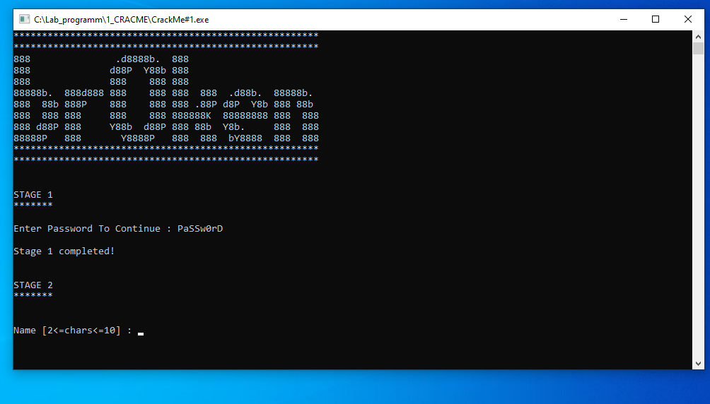

*Рис.8. Результат*

### Этап 2 - Кейген

*Для удобства использования переменных в функции, я некоторые из них переименовала.*

На этапе 2 программа просит пользователя ввести имя, длина которого должна быть от 2 до 10 символов, а также уникальный серийный номер (который зависит от введенного имени):

    ```C
    // часть кода опущена
    printf("\n\n\nSTAGE 2\n");
    printf("*******\n\n");
    printf("\nName [2<=chars<=10] : ");
    scanf("%s", input_name);
    printf("\nSerial : ");
    scanf("%d", &input_num);
    // часть кода опущена
    ```

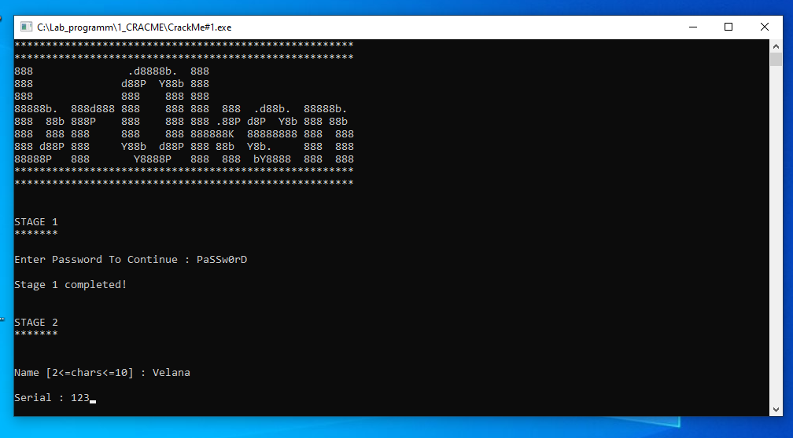

*Рис.9. Ввод пользователя*

И что бы пользователь не вводил: слишком короткое или слишком длинное имя, случайный серийный номер, если, конечно, он не угадает его для введенного имени, программа отобразит провал:

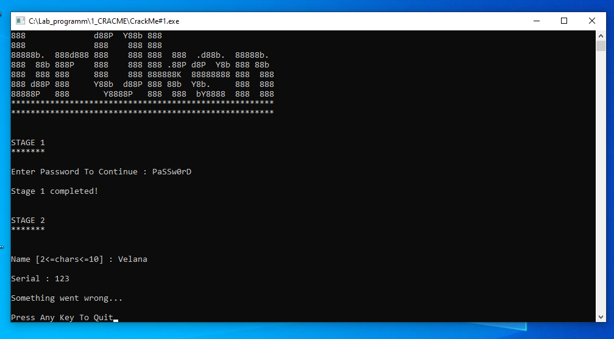

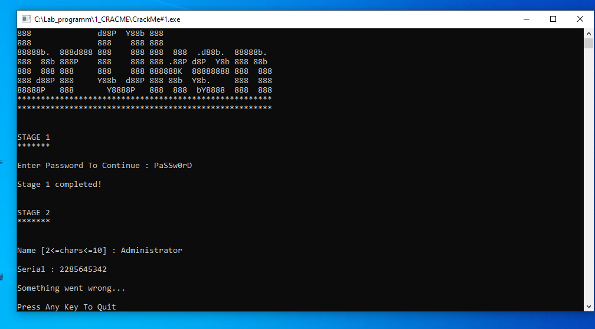

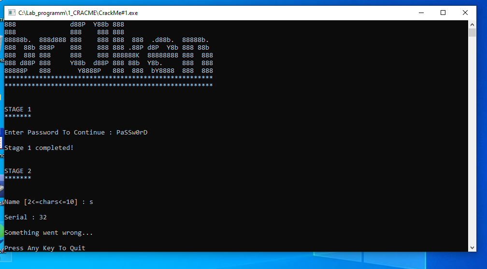

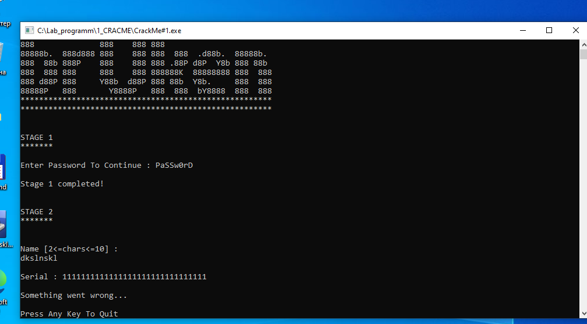

*Рис.10-13. Ввод пользователя*

Логика проверки серийного номера, отражена в следующем коде:

    ```C
    // часть кода опущена
    for ( i = 0; i <= strlen(input_name); ++i )
        serial_num = serial_num + (char)buffer[i - 64] - 1;
    if ( serial_num == input_num )
    {
        printf("\nStage 2 Completed!\n");
        // часть кода опущена
    }
    else
    {
    LABEL_11:
        printf("\nSomething went wrong...\n\nPress Any Key To Quit");
        getch();
    }
    // часть кода опущена
    ```

Используемые переменные:

* int input_num;         // [esp+28h] [ebp-50h] BYREF
* int serial_num;        // [esp+2Ch] [ebp-4Ch]              проверяемое число
* char input_name[16];   // [esp+30h] [ebp-48h] BYREF
* _BYTE buffer[8];       // [esp+70h] [ebp-8h] BYREF

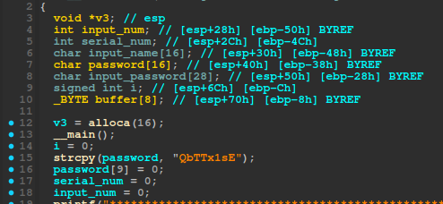

*Рис.14. Используемые переменные(переименованные)*

Цикл перебирает индексы от 0 до длины строки input_name, т.е. помимо введенных пользователем символов будет считаться и завершающий нулевой символ (\0) строки.
Код в цикле поочерёдно берёт символы из массива buffer со смещением -64. Т.к. здесь используется отрицательный индекс, цикл приводит к уязвимости **Out-of-bounds Read (чтение за пределами буфера)**, т.е. он берет данные из массива символов input_name, потому что разница между адресами переменных 0x70 - 0x30 = 0x40, что в десятичной системе равняется 64 байтам. Далее, он преобразует итерируемые символы в тип char, вычитает единицу и прибавляет результат к переменной serial_num. Количество итераций зависит от длины строки input_name.
 
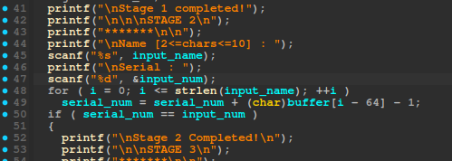

*Рис.15. Цикл 2 этапа*

Благодаря расчету смещений стека, уязвимость Out-of-bounds Read позволяет написать рабочий алгоритм генерации  ключа без необходимости динамической отладки.

[Скрипт генерации серийного номера](./scr_generate_serial.py)

Этот Python-скрипт имитирует поведение процессора при выполнении цикла. Он использует ту же математику, что и оригинальная программа, превращая уязвимость кода в алгоритм генерации.

1. Скрипт проверяет условие на старте: Если ввести имя длиннее 10 символов, оно выйдет за пределы выделенного массива char input_name[16] и перезапишет соседние переменные, что сломает логику вычислений.

    ```python
    if not (2 <= len(name) <= 10):
        print("[-] Ошибка: Длина имени должна быть от 2 до 10 символов!")
        return None
    ```

2. Т.к. цикл считает и завершающий символ( i <= strlen(input_name) ), необходимо искусственно добавить ноль в массив символов:

    ```python
    name_bytes = list(name.encode('utf-8'))
    name_bytes.append(0) 
    ```

3. Т.к. python всегда работает с байтами как с положительными числами (от 0 до 255), необходимо перевести "высокие" байты в отрицательные, как это сделал бы процессор x86:

    ```python
    if char_val > 127:
        char_val -= 256
    ```

4. Переменная serial_num имеет тип int (32 бита), а при сложении множества символов значение этой переменной может стать очень большим и выйти за границы 32 бит. В процессоре в этот момент произошло бы переполнение регистра, и верхние биты просто отсеклись бы, но в Python переменные могут расти бесконечно, поэтому необходимо имитировать 32-битный регистр процессора с помощью побитовой маски & 0xFFFFFFFF:

    ```python
    serial_num = (serial_num + char_val - 1) & 0xFFFFFFFF
    ```

5.  Программа сверяет полученный результат с вводом пользователя через:

    ```C
    scanf("%d", &input_num);
    if ( serial_num == input_num )
    ```

6. Спецификатор %d означает, что серийный номер считывается как знаковое целое число (которое может быть отрицательным). Если в ходе вычислений в скрипте переменная serial_num превысила максимальное положительное значение для 32-битного int (0x7FFFFFFF), то для функции scanf это число станет отрицательным. Поэтому нужно изменить беззнаковое большое число в правильное знаковое представление:

    ```python
    if v6 > 0x7FFFFFFF:
        v6 -= 0x100000000
    ```

Запускаю готовый скрипт через File -> Script command. На ввод имени "Velana" сгенерировался серийный номер 592:

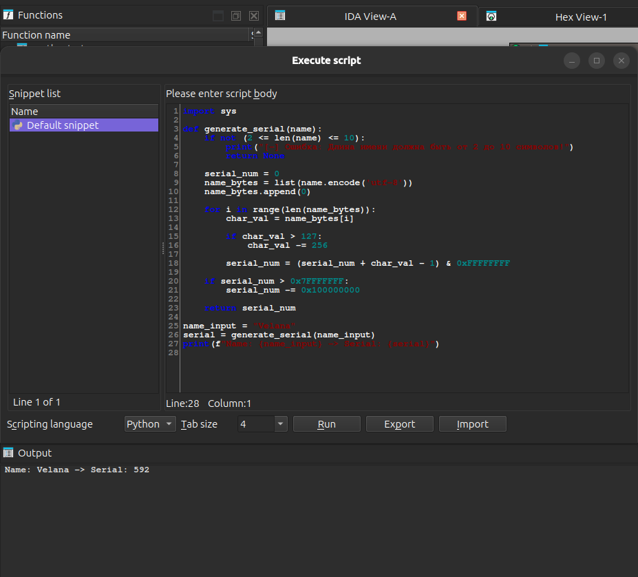

*Рис.16. Запуск скрипта*

## Результат

Для проверки найденного номера, запускаю crackme и ввожу полученные данные:

* **PaSSw0rD** - для прохождения 1 этапа,
* **Velana**   - для имени,
* **592**      - для серийного номера

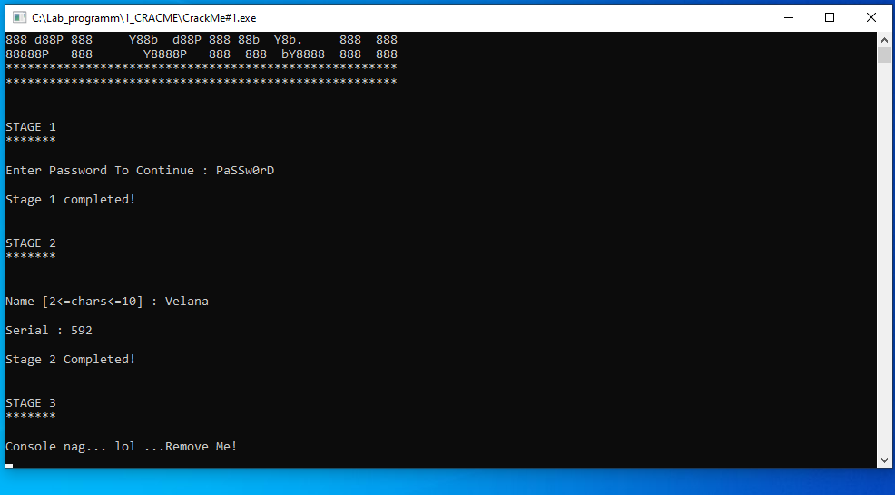

*Рис.17. Проверка найденного номера*

Программа отработала правильно, номер найден и выведена следующая строка с приглашением решить 3 этап crackme.

## Этап 3 — Пропатчить

В правилах к 3 этапу автор написал: "Пропатчить" (и оставил строку-подсказку: "Remove Me!"). В коде программы нет никаких инструкций для того, чтобы эта строка была удалена. Есть только вызов функции getch(), результат выполнения которой ни с чем не сравнивается.

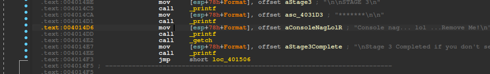

*Рис.18. Участок кода, принадлежий 3 этапу*

Т.к. на 3 этапе в программе выводится только строка и функция getch(), которая просто выступает в роли искусственной паузы, значит исполняемый код, начиная с адреса .text:004014D6 и заканчивая адресом .text:004014E6 включительно, можно затереть инструкциями NOP:

1. mov [esp+78h+Format], offset aConsoleNagLolR (адрес .text:004014D6) - запись адреса строки в стек - 7 байт,
2. call _printf (адрес .text:004014DD) - вызов функции вывода текста - 5 байт,
3. call _getch (адрес .text:004014E2) - вызов функции ожидания нажатия клавиши - 5 байт

**Итого необходимо 17 NOP-инструкций (7 + 5 + 5)**.

В окне ассемблерного графа (IDA-View) я перешла к адресу .text:004014D6 и модифицировала с помощью встроенного ассемблера IDA (Edit -> Patch program -> Assemble) 17 инструкций:

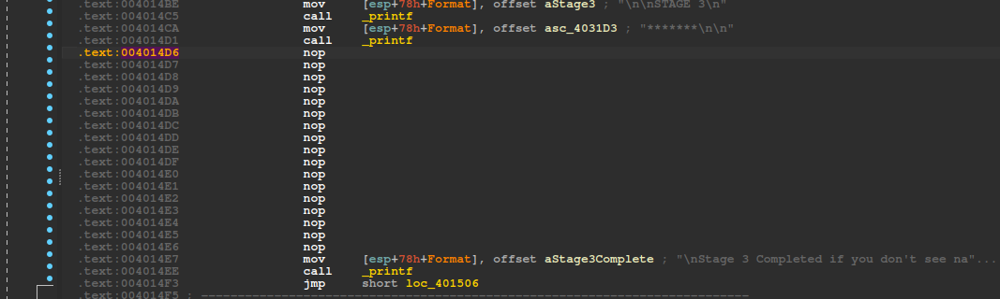

*Рис.19. Модифицированные инструкции*

## Результат

Модифицированные байты были успешно применены и сохранены в исходный файл на диске (Edit -> Patch program -> Apply patches to input file...).
Для проверки результатов файл был запущен внутри изолированной песочницы VirtualBox с Windows. Программа успешно отработала, скрыв строку "Console nag... lol ...Remove Me!" и вывела в консоль финальное сообщение: "Stage 3 Completed if you don't see nag!".

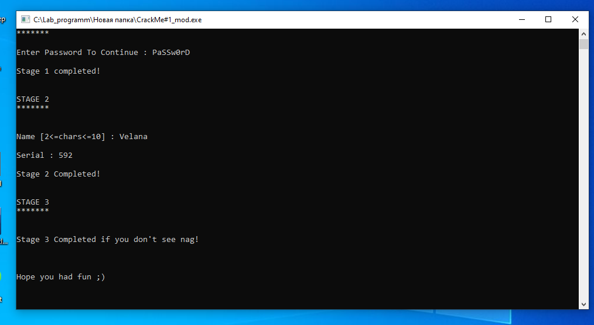

*Рис.20. Результат*

## Статус: Crackme успешно решен (Cracked)
