# Учебное пособие - midicrkme1

## Analyst: Velana

## Host OS: Linux

## Tools Used:  IDA Pro (статический анализ), VirtualBox(Windows)

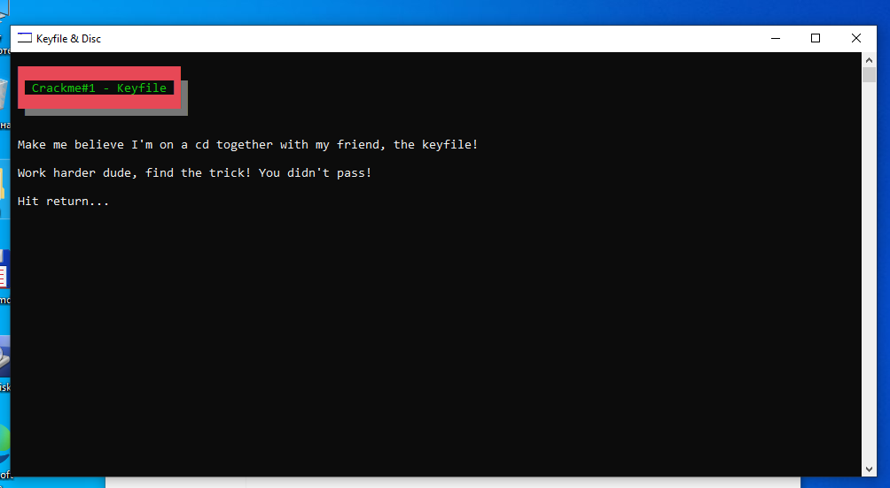

*Рис.1. Старт crackme

## Инструкции автора

Перед началом анализа были зафиксированы следующие правила и ограничения:

1. Разрешена модификация кода программы.
2. Разрешена динамическая отладка.
3. Файл лицензии (keyfile) можно либо пропатчить, либо создать с нуля.
4. Запрещено создание физического или виртуального CD-диска с записанным рабочим ключом для прохождения проверки.

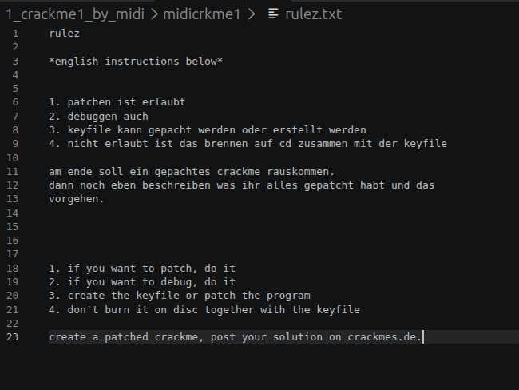

*Рис.2. Инструкции автора

## Процесс исследования

1. **Поиск точки входа**: Исполняемый файл был загружен в Linux-версию IDA Pro. На этапе первичного статического анализа я перешла во вкладку доступных строк (Strings).

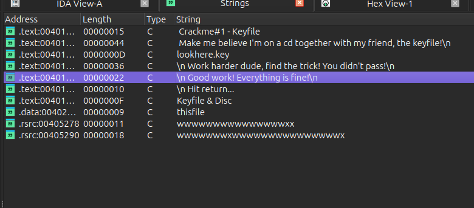

*Рис.3. Доступные строки*

Обнаружив строку успешного прохождения "\n Good work! Everything is fine!\n", применила метод анализа "от обратного". Используя перекрестные ссылки (XREFs) из адреса .text:00401311 (где хранится данный текст), я перешла к вызывающей функции, отвечающей за валидацию.

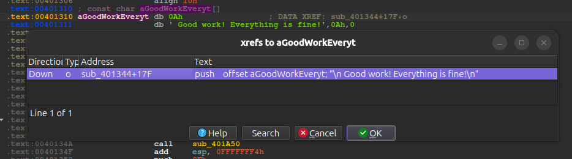

*Рис.4. Перекрестные ссылки для строки*

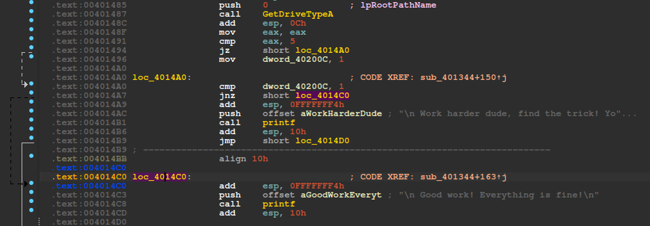

*Рис.5. Функция в дизассемблере*

2. **Анализ логики валидации (Декомпиляция)**: Переключившись в окно встроенного декомпилятора (Pseudocode),

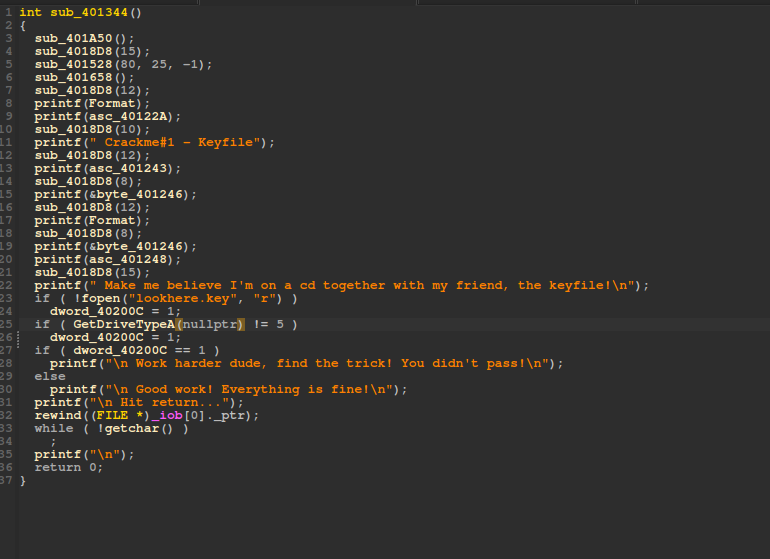

*Рис.6. Функция в декомпиляторе*

я увидела, что в этой функции программа пытается открыть файл с именем lookhere.key в режиме чтения ("r") и если файл отсутствует в директории приложения (функция вернула ошибку) глобальному флагу ошибки dword_40200C принудительно присваивается значение 1:

    ```C
    // проверка наличия файла ключа
    if(!fopen("lookhere.key", "r"))
      dword_40200C = 1;
    // часть кода пропущена
    ```

а также здесь вызывается функцию Windows API GetDriveTypeA(nullptr) для определения типа диска, с которого запущен процесс. Константа 5 в Windows API соответствует флагу DRIVE_CDROM (CD-дисковод). Если приложение запущено НЕ с CD-ROM, флаг ошибки снова становится 1:

    ```C
    // проверка запуска с CD-ROM
    if(GetDriveTypeA(nullptr) != 5)
      dword_40200C = 1;
    // часть кода пропущена
    ```

финальное сравнение: Программа анализирует состояние переменной dword_40200C. Если на предыдущих этапах произошел сбой (флаг равен 1), управление передается ветке с сообщением о провале. Для успешного прохождения crackme необходимо, чтобы переменная сохранила свое исходное значение 0:

    ```C
    // финальное ветвление
    if(dword_40200C == 1)
        printf("\n Work harder dude, find the trick! You didn't pass!\n");
    else
        printf("\n Good work! Everything is fine!\n");
    // часть кода пропущена
    ```

## Модификация бинарного файла

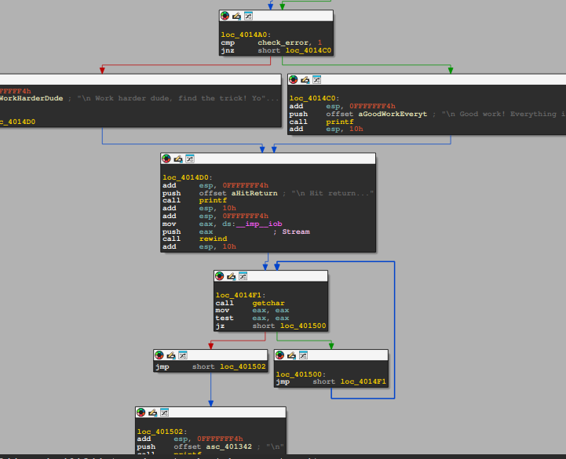

*Рис.7. Переходы в коде*

Поскольку создание CD-диска запрещено правилами автора, а логика программы опирается на состояние одной переменной, было принято решение модифицировать инструкцию финального условного перехода.

1. В окне ассемблерного графа (IDA-View) я перешла к адресу .text:004014A7.

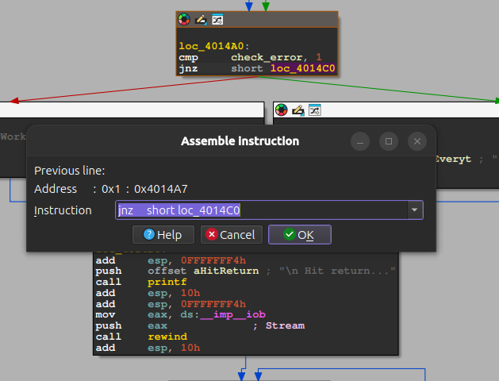

*Рис.8. Инструкция для патчинга*

2. Текущая инструкция условного перехода jnz short loc_4014C0 (переход, если флаг ошибки НЕ равен нулю) была модифицирована с помощью встроенного ассемблера IDA (Edit -> Patch program -> Assemble).

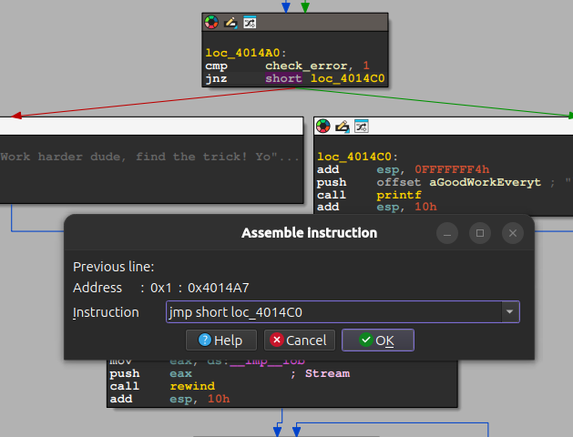

*Рис.9. Модицированная инструкция*

3. Инструкция была заменена на команду безусловного перехода:

    ```assembly
    jmp short loc_4014C0
    ```

    Это гарантирует, что процессор всегда будет передавать управление ветке успешного решения (loc_4014C0), полностью игнорируя результаты проверок файла и диска.

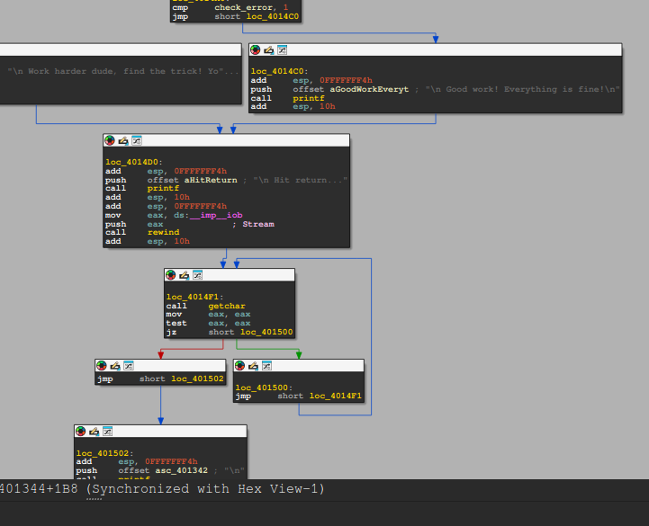

*Рис.10. Результат патча*

## Результат

Модифицированные байты были успешно применены и сохранены в исходный файл на диске (Edit -> Patch program -> Apply patches to input file...).
Для проверки результатов файл был запущен внутри изолированной песочницы VirtualBox с Windows. Программа успешно отработала, обойдя защиту, и вывела в консоль финальное сообщение: "Good work! Everything is fine!".

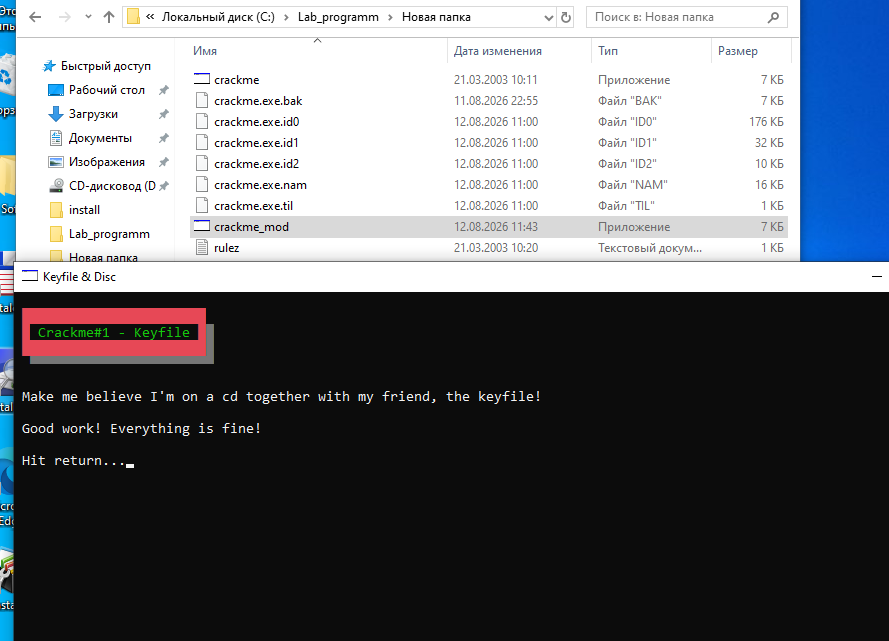

*Рис.11. Результат*

## Статус: Crackme успешно решен (Cracked)
