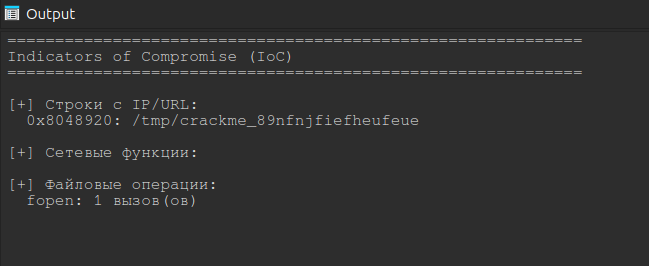
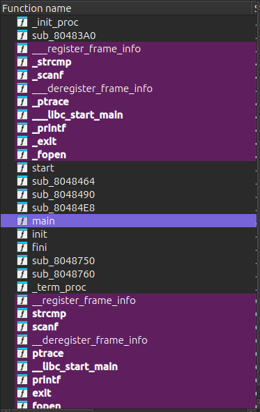
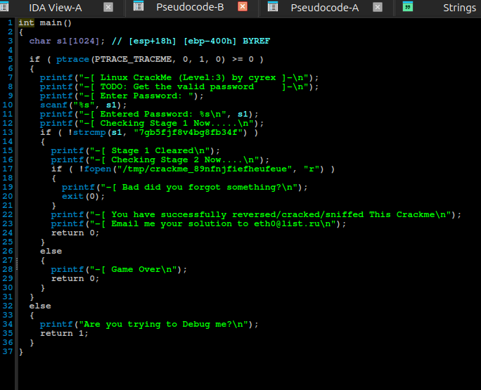
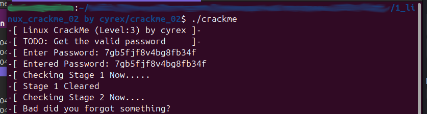
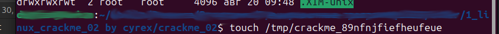
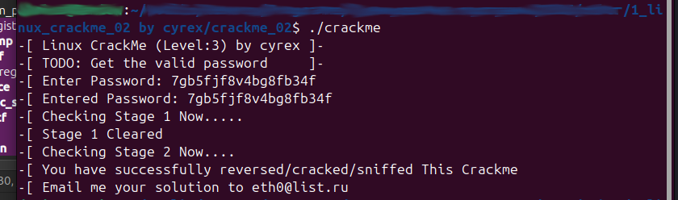

# Учебное пособие - linux_crackme_02 by cyrex

## Analyst: Velana

## Host OS: Linux

## Tools Used:  IDA Pro (статический анализ), скрипты автоматизации анализа

### Информация об исследуемом файле

| Параметр | Значение |
| :--- | :--- |
| **Имя файла** | `linux_crackme_02` |
| **Архитектура / Формат** | ELF for Intel 386 (32-bit Executable) |
| **Компилятор** | GNU C++ |
| **SHA-256 хэш** | `020F37BA1863E58D11B7F9CCDA633B33C0687CF6F1E3166822E1B3FD2005352E` |
| **MD5 хэш** | `890C4C7B7994B422803E0647BCBA22AF` |

---

### Цель исследования

Анализ исполняемого файла с целью поиска условий успешной валидации. Исходные инструкции от автора отсутствовали.

## Исследование

1. На первичном этапе был запущен готовый скрипт поиска базовых индикаторов компрометации (IOC). Он выявил строку пути `/tmp/crackme_89nfnjfiefheufeue` и один вызов функции `fopen`. Подозрительной сетевой активности не обнаружено. Файл безопасен для исследования.

```python
import idc
import idautils

def extract_iocs():
    """Извлечение IoC из ELF-малвари"""
    print("=" * 60)
    print("Indicators of Compromise (IoC)")
    print("=" * 60)

    # 1. IP-адреса и URL из строк
    print("\n[+] Строки с IP/URL:")
    sc = idautils.Strings()
    for s in sc:
        val = str(s)
        # Проверяем ключевые слова для поиска сетевых и файловых IoC
        if any(kw in val for kw in ["http", "192.", "10.", "172.", ".php", ".onion", "cmd_", "/tmp/", "/bin/"]):
            print(f"  {s.ea:#x}: {val}")

    # Функция-помощник для надежного поиска адреса API и его вызовов в ELF
    def get_func_calls_count(func_name):
        # Пробуем разные варианты имен, которые IDA дает импортам в ELF
        variants = [func_name, f".{func_name}", f"_{func_name}"]
        for var in variants:
            ea = idc.get_name_ea_simple(var)
            if ea != idc.BADADDR:
                # Находим все перекрестные ссылки (вызовы) на эту функцию
                xrefs = list(idautils.CodeRefsTo(ea, False))
                return len(xrefs)
        return 0

    # 2. Используемые сетевые функции
    print("\n[+] Сетевые функции:")
    net_funcs = ["socket", "connect", "bind", "listen", "accept", "send", "recv", "sendto", "recvfrom", "inet_addr"]
    for name in net_funcs:
        calls = get_func_calls_count(name)
        if calls > 0:
            print(f"  {name}: {calls} вызов(ов)")

    # 3. Файловые операции
    print("\n[+] Файловые операции:")
    file_funcs = ["fopen", "open", "fwrite", "write", "unlink", "rename"]
    for name in file_funcs:
        calls = get_func_calls_count(name)
        if calls > 0:
            print(f"  {name}: {calls} вызов(ов)")

extract_iocs()
```



*Рис.1. Результат работы скрипта*

В окне Function Name была обнаружена главная функция - main. 



*Рис.2. Окно Function Name*

При детальном анализе этой функции была восстановлена полная логика работы программы, состоящая из трех этапов: защиты от отладки, проверки пароля и проверки файла.



*Рис.3. Функция main в декомпилированном виде*

### Этап 1: Anti-Debugging (Защита от отладки)

В самом начале функция main выполняет системный вызов ptrace(PTRACE_TRACEME, 0, 1, 0). Если программа запущена под отладчиком, этот вызов возвращает ошибку ('-1'), программа выводит сообщение "Are you trying to Debug me?" и завершает работу. Статический анализ в IDA Pro позволил обойти эту проверку, не прибегая к патчингу бинарника.

### Этап 2: Валидация пароля (Stage 1)

Если отладчик не обнаружен, программа запрашивает ввод пароля через функцию scanf. Введенная строка 's1' сравнивается с жестко закодированным ключом "7gb5fjf8v4bg8fb34f" с помощью функции strcmp. При их совпадении программа переходит к Stage 2. В противном случае выводится "Game Over".

    ```C
    printf("-[ Enter Password: ");
    scanf("%s", s1);
    printf("-[ Entered Password: %s\n", s1);
    printf("-[ Checking Stage 1 Now.....\n");
    if ( !strcmp(s1, "7gb5fjf8v4bg8fb34f") )
    // часть кода опущена
    ```

Запускаю программу и проверяю строку "7gb5fjf8v4bg8fb34f" на правильную секретную строку.



*Рис.4. Проверка секретной строки*

### Этап 3: Проверка файловой системы (Stage 2)

После успешного ввода пароля программа пытается открыть файл по пути /tmp/crackme_89nfnjfiefheufeue в режиме чтения ("r").
Конструкция if ( !fopen(...) ) проверяет успешность открытия:

* Если файл **отсутствует**, функция возвращает 'NULL', срабатывает условие ошибки, и программа завершается с текстом "Bad did you forgot something?".
* Если файл **существует**, программа успешно проходит проверку и выводит финальный флаг.

Судя по подсказке автора ("Bad did you forgot something?"), я действительно забыла создать файл. Иду в терминал и создаю пустой файл с помощью команды touch.



*Рис.5. Создание необходимого файла*

Снова запускаю программу и проверяю:



*Рис.6. Результат работы программы*

## Результат

Оба условия (проверка строки и проверка наличия файла) успешно отработали. Программа подтвердила правильность взлома и вывела на экран финальное поздравительное сообщение: "You have successfully reversed/cracked/sniffed This Crackme".
Поставленная задача полностью решена. Логика валидации была успешно реконструирована исключительно методами статического анализа, несмотря на отсутствие какой-либо сопроводительной документации и инструкций от автора.

## Статус: Crackme успешно решен (Cracked)
