# Учебное пособие - NTS-Crackme3 by Cyclops

## Analyst: Velana

## Host OS: Linux

## Tools Used:  IDA Pro (статический анализ), VirtualBox(Windows)

## Инструкции автора

1. Найти серийный номер.
2. Написать собственную утилиту, которая изменяет байты в исполняемом файле (.exe) CrackMe так, чтобы он принимал любой неверный ключ как правильный.
3. Написать программу-загрузчик, которая запускает оригинальный CrackMe и изменяет его поведение прямо в оперативной памяти, не трогая сам файл на диске.

[Rules](./Readme3.txt)

*Рис.2. Инструкции автора

## Решение

### 1 - Найти серийный номер

1. Исполняемый файл был загружен в Linux-версию IDA Pro. На этапе первичного статического анализа я перешла во вкладку доступных строк (Strings).

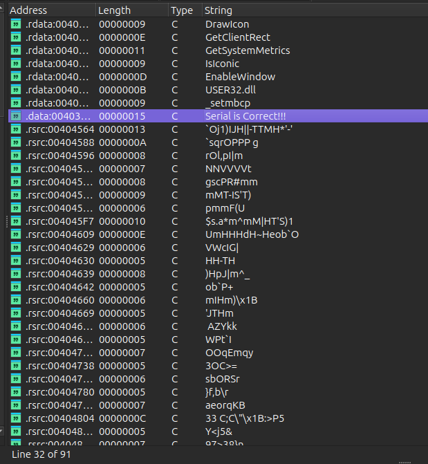

*Рис.1. Доступные строки*

Обнаружив строку успешного прохождения "Serial is Correct!!!", применила метод анализа "от обратного". Используя перекрестные ссылки (XREFs) адреса .rdata:00403020 (где хранится данный текст), я перешла в вызывающую функцию.

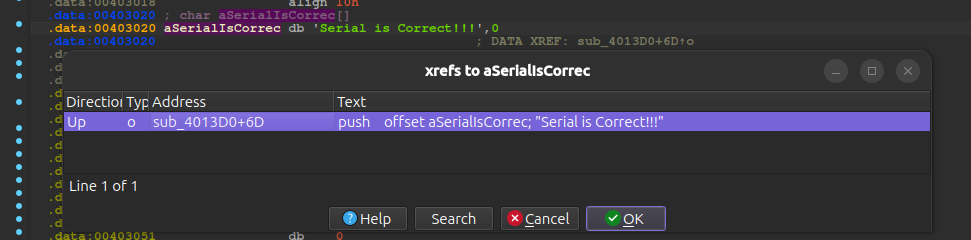

*Рис.2. Перекрестные ссылки для строки*

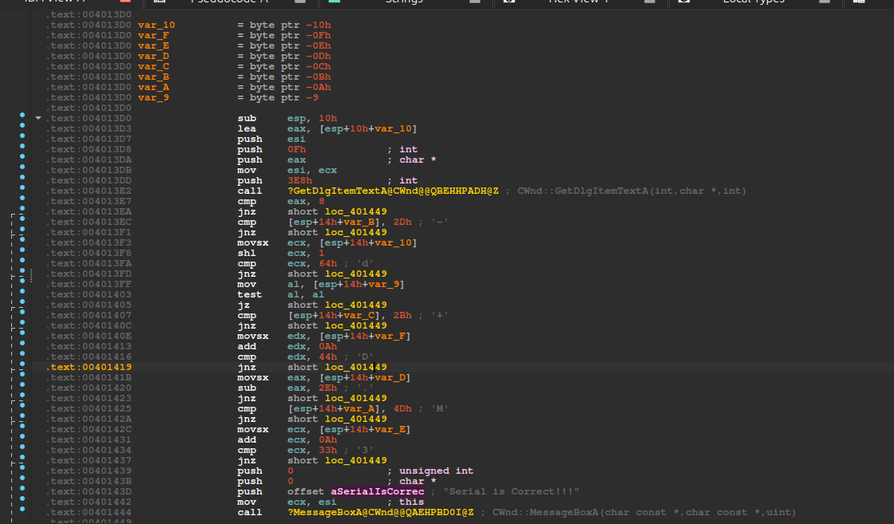

*Рис.3. Переход по ссылке*

2. **Анализ логики (Декомпиляция)**: Переключившись в окно встроенного декомпилятора (Pseudocode),

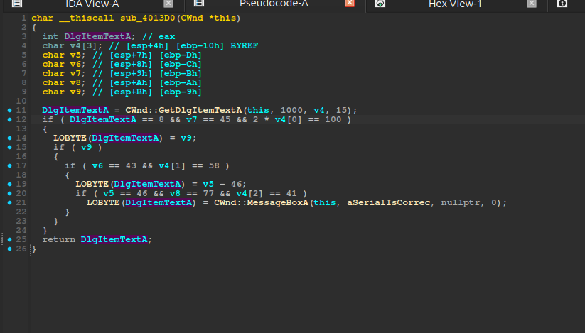

*Рис.4. Функция в декомпиляторе*

я увидела, что эта функция выполняет два действия: собирает вводные данные и проверяет их.

    ```C
    // сбор вводных данных 
    DlgItemTextA = CWnd::GetDlgItemTextA(this, 1000, v4, 15);

    // часть кода опущена
    ```

Введенная пользователем строка, состоящая из 8 символов (if (DlgItemTextA == 8 && v7 == 45 && 2 * v4[0] == 100)), сохраняется в буфер, который компилятор разбил в памяти на отдельные переменные: массив v4[3] и идущие следом за ним в стеке одиночные байты-символы: v5, v6, v7, v8, v9. Поскольку буфер v4 объявлен как массив всего из 3 элементов, а функция GetDlgItemTextA записывает туда до 15 байт, происходит контролируемое "переполнение" локального массива. Введенные пользователем символы, начиная с 4-го, физически затирают переменные v5, v6, v7, v8 и v9. Т.е. чтобы код выглядел более понятно, можно изменить тип массива char v4[3] на char v4[15]:

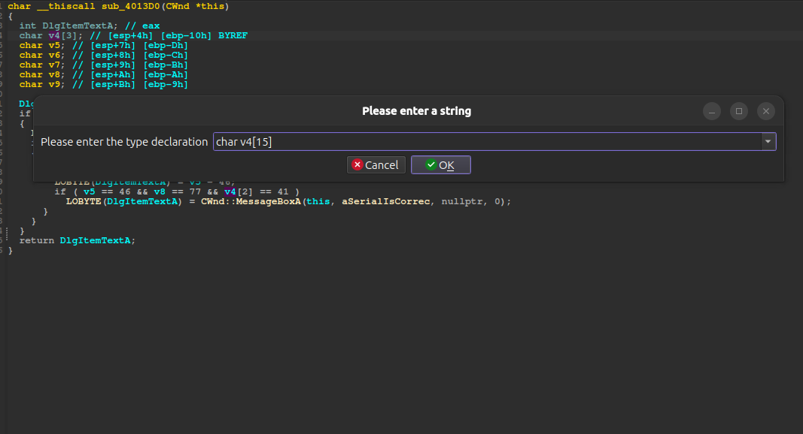
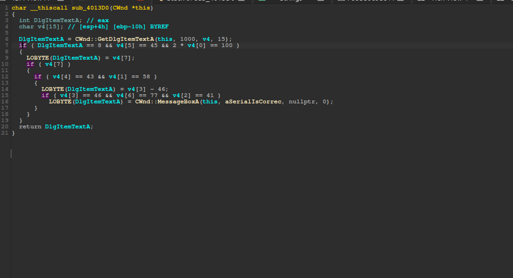

*Рис.5-6. Изменение типа массива*

Теперь можно легко узнать коды символов строки и их индекс в массиве и получить серийный номер(ASCII):

    ```C
    v4[0] = 50 -> '2',        // 2 * v4[0] == 100
    v4[1] = 58 -> ':',        // v4[1] == 58
    v4[2] = 41 -> ')',        // v4[2] == 41
    v4[3] = 46 -> '.',        // v4[3] == 46
    v4[4] = 43 -> '+',        // v4[3] == 43
    v4[5] = 45 -> '-',        // v4[3] == 45
    v4[6] = 77 -> 'M',        // v4[3] == 77
    v4[7] = any_character,    // if ( v4[7] ) - может быть любой символ, проверяется просто его наличие 

    ```

**Найденная строка: "2:).+-Mx"** - последний символ может быть любой.

## Результат

Для проверки правильности найденной строки программа была запущена внутри изолированной песочницы VirtualBox с Windows. Она успешно отработала и вывела в консоль сообщение: "Serial is Correct!!!".

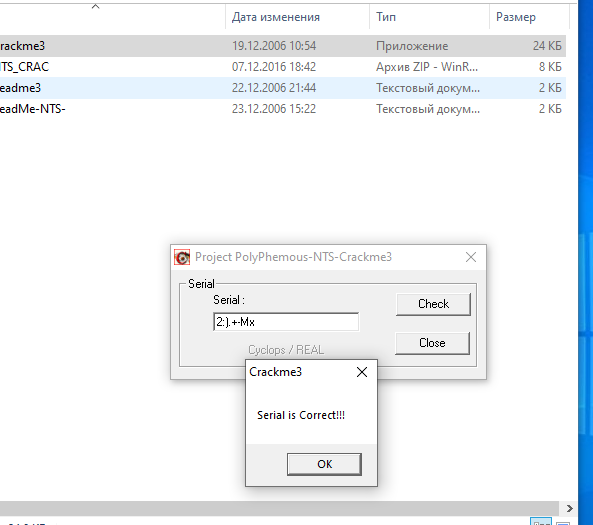

*Рис.7. Результат*

### 2 - Написать утилиту, благодаря которой можно вводить любую строку

Чтобы программа могла принимать любую строку, необходимо найти и пропатчить условные переходы, которые не могут привести к успешному результату.
Для этого нужно посмотреть на функцию проверки серийного номера в дизассемблерном варианте:

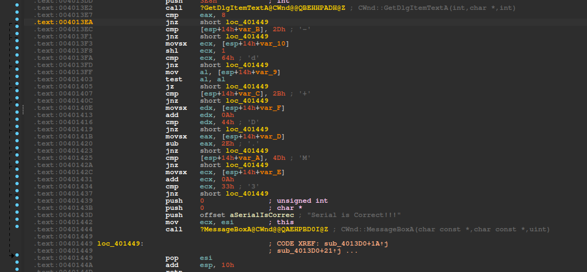

*Рис.8. Функция проверки вводимой строки с отображением условных переходов*

Т.к. автор программы использовал вложенные условия, я не могу изменить какое-то одно из них. Мне необходимо пропатчить их все.

    ```C
    if ( DlgItemTextA == 8 && v4[5] == 45 && 2 * v4[0] == 100 )
    {
        LOBYTE(DlgItemTextA) = v4[7];
        if ( v4[7] )
        {
        if ( v4[4] == 43 && v4[1] == 58 )
        {
            LOBYTE(DlgItemTextA) = v4[3] - 46;
            if ( v4[3] == 46 && v4[6] == 77 && v4[2] == 41 )
            LOBYTE(DlgItemTextA) = CWnd::MessageBoxA(this, aSerialIsCorrec, nullptr, 0);
        }
        }
    }
    ```

    ```C
    //адреса переходов, которые нужно пропатчить
    .text:0x004013EA  // DlgItemTextA == 8 - проверка, что длина введенной строки равна 8 символам.
    .text:0x004013F1  // v4[5] == 45       - проверка 6-го символа строки на дефис ('-')
    .text:0x004013FD  // 2 * v4[0] == 100  - проверка 1-го символа на равенство цифре ('2')
    .text:0x00401405  // if ( v4[7] )      - проверка 8-го символа на неравенство нулю
    .text:0x0040140C  // v4[4] == 43       - проверка 5-го символа строки на знак плюс ('+')
    .text:0x00401419  // v4[1] == 58       - проверка 2-го символа строки на двоеточие (':')
    .text:0x00401423  // v4[3] == 46       - проверка 4-го символа строки на точку ('.')
    .text:0x0040142A  // v4[6] == 77       - проверка 7-го символа строки на заглавную букву ('M')
    .text:0x00401437  // v4[2] == 41       - проверка 3-го символа строки на закрывающую скобку (')')
   
    ```

[Patcher](./patcher.py)

Этот Python-скрипт проверяет файл на диске, создает его бэкап, а потом открывает оригинальный файл, перемещает "курсор" на нужный адрес и перезаписывает байты.

1. Переменные, в которых хранятся имена файлов: оригинального исполняемого файла и его резервной копии.

    ```python
    TARGET_FILE = "Crackme3.exe"
    BACKUP_FILE = "NTS-Crackme3.bak"
    ```

2. Создается словарь - структура данных для патчинга, где имеется ключ - файловое смещение (напр., 0x1423) и значение словаря - байт, предназначенный для изменения (напр., b"\x75": b - "bytes" (сырые байты), а \x75 - код инструкции JNZ.)

    ```python
    PATCHES = {
    0x13EA: b"\x74",  
    0x13F1: b"\x74", 
    0x13FD: b"\x74",  
    0x140C: b"\x74", 
    0x1419: b"\x74",  
    0x1423: b"\x74",  
    0x142A: b"\x74",  
    0x1437: b"\x74",  
    0x1405: b"\x75",  
    }
    ```

3. Проверка наличия исполняемого файла в папке со скриптом и создание его резервной копии.

    ```python
        if not os.path.exists(TARGET_FILE):
        print(f"[!] Файл {TARGET_FILE} не найден в текущей папке.")
        return

    if not os.path.exists(BACKUP_FILE):
        shutil.copyfile(TARGET_FILE, BACKUP_FILE)
        print(f"[+] Создан бэкап оригинального файла: {BACKUP_FILE}")

    ```

4. В блоке try-except файл открывается в режиме чтения и записи (+) в бинарном формате (b)с гарантией, что файл автоматически и правильно закроется, если внутри произойдет сбой. А дальше в цикле берется пара из словаря PATCHES, применяется смещение по ключу и меняется байт инструкции. Для следующей итерации виртуальный указатель внутри файла перемещаетсяна следующую позицию по смещению.

    ```python
    with open(TARGET_FILE, "r+b") as f:
            for offset, new_bytes in PATCHES.items():
                f.seek(offset)          
                f.write(new_bytes)      
                print(f"[+] Смещение 0x{offset:X} успешно пропатчено байтами: {new_bytes.hex().upper()}")
        print("[+++] Файл полностью пропатчен!")

    ```

## Результат

Сохраняю готовый скрипт в папку с crackme и запускаю через командную строку в ВМ Windows.

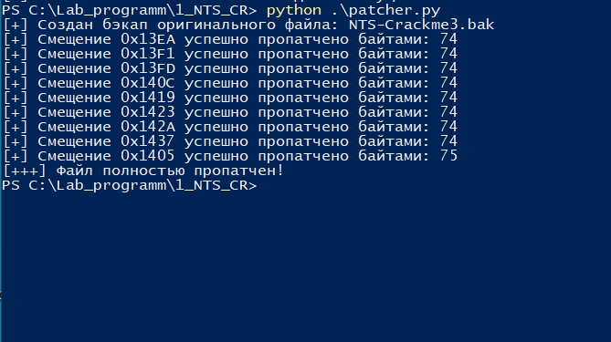
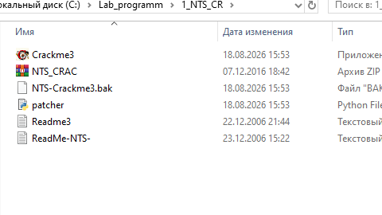

*Рис.9-10. Запуск скрипта*

На ввод любой секретной строки, в том числе "velana", программа отреагировала желанным сообщением: "Serial is Correct!!!".

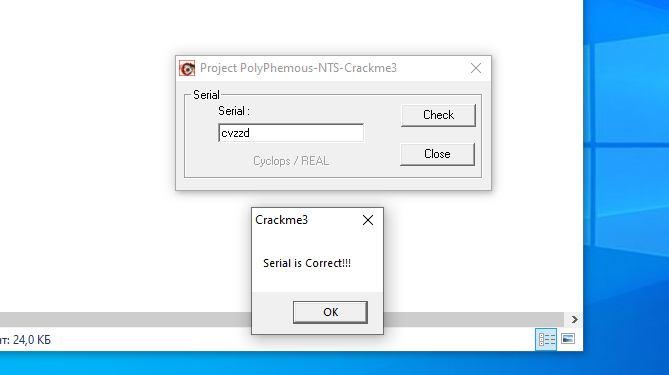
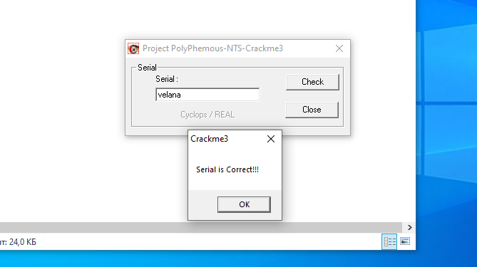

*Рис.11-12. Запуск модифицированного crackme*

## 3 - Написать загрузчик, который запускает оригинальный CrackMe и изменяет его поведение в ОП, не трогая сам файл на диске

Загрузчик не должен работать с файлом на диске напрямую. Вместо этого он будет управлять процессом crackme через специальные системные функции. Поэтому необходимо использовать модуль ctypes, который позволяет вызывать низкоуровневые функции операционной системы Windows.

[Loader](./loader.py)

Итак, для начала необходимо подготовить константы:

    ```python
    CREATE_SUSPENDED = 0x00000004       # флаг создания приостановленного процесса
    PAGE_EXECUTE_READWRITE = 0x40       # права доступа к памяти RWX
    TARGET_PROCESS = "Crackme3.exe"     # имя запускаемого приложения
    ```

Предварительно найдя адреса памяти переходов, я снова меняю логику, только уже не по смещению, а по вычисленным виртуальным адресам, т.к. процесс находится в оперативной памяти.

    ```python
    MEMORY_PATCHES = {
        0x004013EA: b"\x74",  
        0x004013F1: b"\x74", 
        0x004013FD: b"\x74",  
        0x0040140C: b"\x74", 
        0x00401419: b"\x74",  
        0x00401423: b"\x74",  
        0x0040142A: b"\x74",  
        0x00401437: b"\x74",  
        0x00401405: b"\x75",
    }
    ```
Объявляю структуры Windows API: блоки class PROCESS_INFORMATION и class STARTUPINFO для того, чтобы операционная система при запуске заполнила их уникальными идентификаторами и дескрипторами целевого процесса.

    ```python
    class PROCESS_INFORMATION(ctypes.Structure):
        _fields_ = [
            ("hProcess", ctypes.c_void_p),
            ("hThread", ctypes.c_void_p),
            ("dwProcessId", ctypes.c_ulong),
            ("dwThreadId", ctypes.c_ulong)
        ]

    class STARTUPINFO(ctypes.Structure):
        _fields_ = [
            ("cb", ctypes.c_ulong), ("lpReserved", ctypes.c_char_p), ("lpDesktop", ctypes.c_char_p),
            ("lpTitle", ctypes.c_char_p), ("dwX", ctypes.c_ulong), ("dwY", ctypes.c_ulong),
            ("dwXSize", ctypes.c_ulong), ("dwYSize", ctypes.c_ulong), ("dwXCountChars", ctypes.c_ulong),
            ("dwYCountChars", ctypes.c_ulong), ("dwFillAttribute", ctypes.c_ulong), ("dwFlags", ctypes.c_ulong),
            ("wShowWindow", ctypes.c_ushort), ("cbReserved2", ctypes.c_ushort), ("lpReserved2", ctypes.c_char_p),
            ("hStdInput", ctypes.c_void_p), ("hStdOutput", ctypes.c_void_p), ("hStdError", ctypes.c_void_p)
        ]
    ```

Cкрипт выделяет в памяти два чистых объекта на основе этих структур.

    ```python
    si = STARTUPINFO()           # информация о запуске
    si.cb = ctypes.sizeof(si)    # размер структуры в байтах
    pi = PROCESS_INFORMATION()   # информация о созданном процессе
    ```
Далее при помощи системной библиотеки Windows - kernel32 загружаем программу в память, выделяя под нее ресурсы, но не даем ей выполниться, используя параметра CREATE_SUSPENDED:

    ```python
    success = ctypes.windll.kernel32.CreateProcessA(
        None, TARGET_PROCESS.encode('ascii'), None, None, False,
        CREATE_SUSPENDED, None, None, ctypes.byref(si), ctypes.byref(pi)
    )
    ```
Если запуск удался, то можно управлять программой с помощью дескрипторов:

    ```python
    h_process = pi.hProcess   # управление памятью процесса
    h_thread = pi.hThread     # управление жизненным циклом процесса
    ```
Теперь скрипт начинает работать с адресами и байтами из словаря MEMORY_PATCHES. По умолчанию память процесса с кодом защищена от изменений. Функция VirtualProtectEx временно меняет права доступа для конкретного адреса на PAGE_EXECUTE_READWRITE (разрешено: чтение, запись, выполнение). Старые права Windows сохраняет в переменную old_protect.

    ```python
    kernel32.VirtualProtectEx(h_process, addr, data_len, PAGE_EXECUTE_READWRITE, ctypes.byref(old_protect))
    ```
Когда защита снята, функция WriteProcessMemory берет байт (например, \x74) и записывает его поверх оригинального байта программы Crackme3.exe.

    ```python
    res = kernel32.WriteProcessMemory(h_process, addr, data, data_len, ctypes.byref(bytes_written))
    ```
Позже скрипт возвращает права доступа к этому участку памяти в исходное состояние (old_protect), чтобы программа не выглядела подозрительно для операционной системы.

    ```python
    kernel32.VirtualProtectEx(h_process, addr, data_len, old_protect, ctypes.byref(old_protect))
    ```
Операция завершена, все нужные инструкции JZ и JNZ подменены. Скрипт отдает команду "оживить" главный поток процесса. Crackme3.exe просыпается и начинает выполняться дальше, но уже со взломанной логикой. Далее освобождаются системные ресурсы, закрываются дескрипторы (h_thread и h_process) - программа успешно пропатчена.

## Результат

Нужно вернуть оригинальный файл crackme, для этого удаляю загружаемый файл Crackme3.exe(т.к. после скрипта patcher.py инструкции там модифицированые). После этого копирую NTS-Crackme3.bak, меняю имя и расширение и оригинальный файл восстановлен.
Сохраняю готовый скрипт-загрузчик в папку с исполняемым файлом и запускаю через командную строку в ВМ Windows. Тут же запускается и программа crackme, предлагая мне ввести секретную строку.

На ввод любой строки, в том числе "velana", программа отреагировала желанным сообщением: "Serial is Correct!!!".

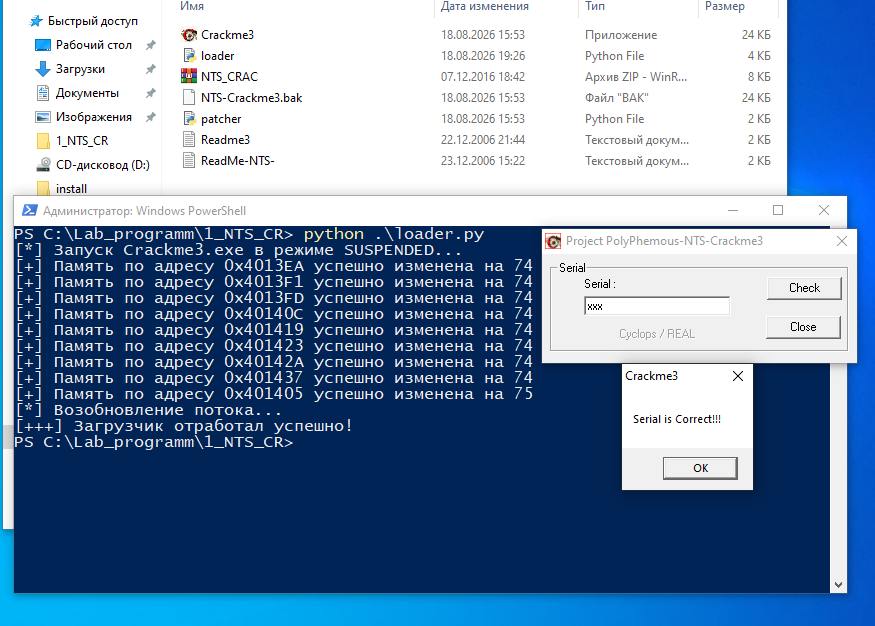
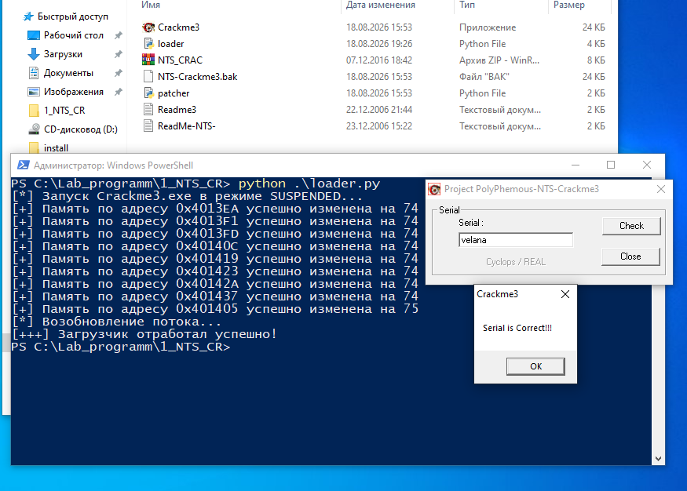

*Рис.13-14.Результат работы скрипта-загрузчика*

## Статус: Crackme успешно решен (Cracked)
